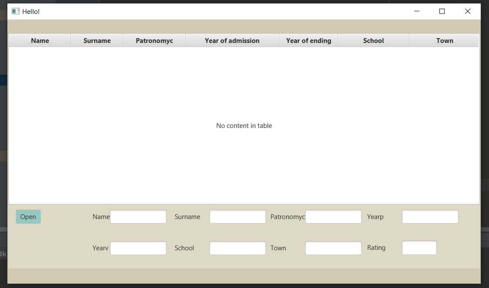
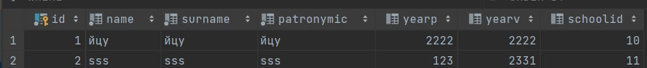
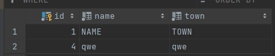
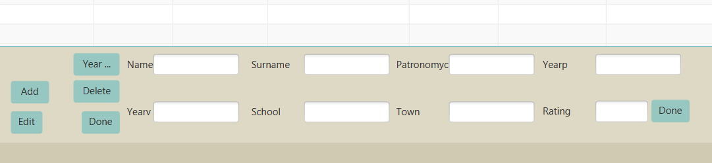
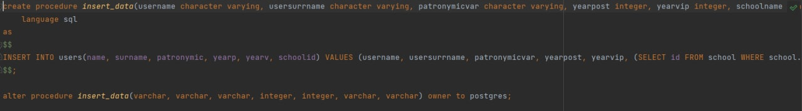

## A simple application that outputs data from the database into a table and allows you to do certain manipulations on it

UI javaFX

Data base Postgresql

The application shows students the years of their admission and graduation allows you to add students to the database and edit information about the school. There is also a function to display students who have studied in a particular year and calculate the rating of the school.

### App appearance

### 

### Table of students

### School table

### 

### Appearance when the open button is pressed

### The implementation of adding a student uses a stored procedure that is textually stored in the bd file procedure.txt 

